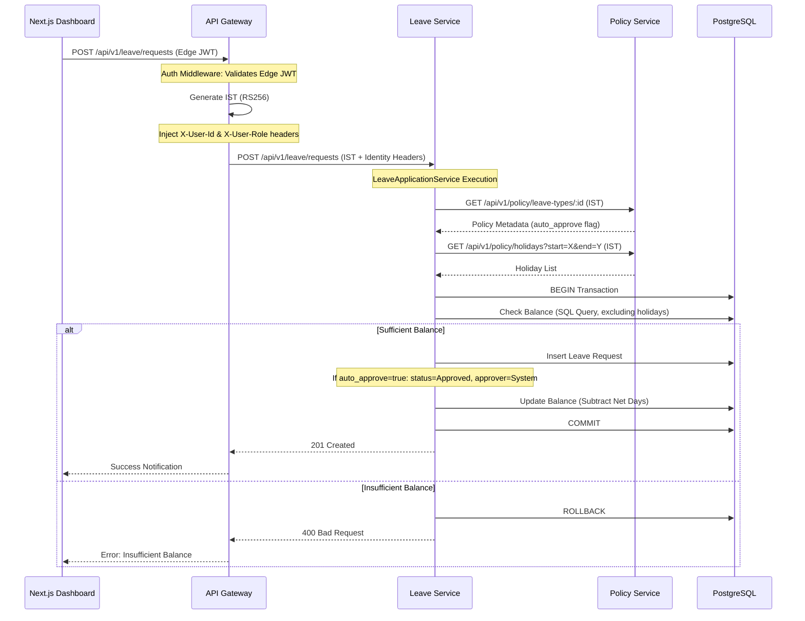

# Technical Design Document

## 🌊 Core Flow: Leave Application
This diagram illustrates the sequence of events when a staff member applies for leave through the dashboard.

## 🧠 Business Rules Gating

### 1. Auto-Approval (FR-4.1)
The system supports policy-defined automated approvals.
- **Trigger:** Configured at the `LeaveType` level in the Policy Service.
- **Actor:** Recorded as `Uuid::nil()` (System User).
- **Effect:** Skips the manager approval queue and immediately deducts balance.

### 2. Holiday-Aware Duration (FR-4.3)
Duration calculation logic is offloaded to the core domain but depends on the Policy Service for source data.
- **Logic:** `NetDays = TotalDays - Weekends - PublicHolidays`.
- **Source:** Public holidays are dynamic and region-specific, managed in the `Policy Service`.

### 3. Approver Delegation (FR-4.2)
- **Check:** Before permitting an approval, the Leave Service queries the Staff Service to verify if the actor is either the designated manager or an active delegatee.
- **IST Usage:** Uses a `system-token` for the delegation check to ensure high-priority access.

## 🏗️ Architecture: Hexagonal Pattern
Each service is partitioned into:
1. **Core Domain:** Business logic (`BigDecimal` calculations, state transitions).
2. **Ports:** Traits defining required behaviors (`LeaveRepository`, `PolicyProvider`).
3. **Adapters:** 
    - **Handler:** Axum HTTP endpoints.
    - **Repository:** SQLx Postgres implementations.
    - **Gateway:** External service clients (reqwest).

## 🔭 Observability Strategy
- **Traces:** Full-stack propagation from Browser -> Gateway -> Services.
- **Context:** Standard OTel `traceparent` headers are used for all inter-service calls.
- **Collector:** OpenTelemetry Collector (v0.31) exports to Jaeger.
- **Identity:** `X-User-Id` is propagated to services to ensure consistent logging of user actions across the trace.
