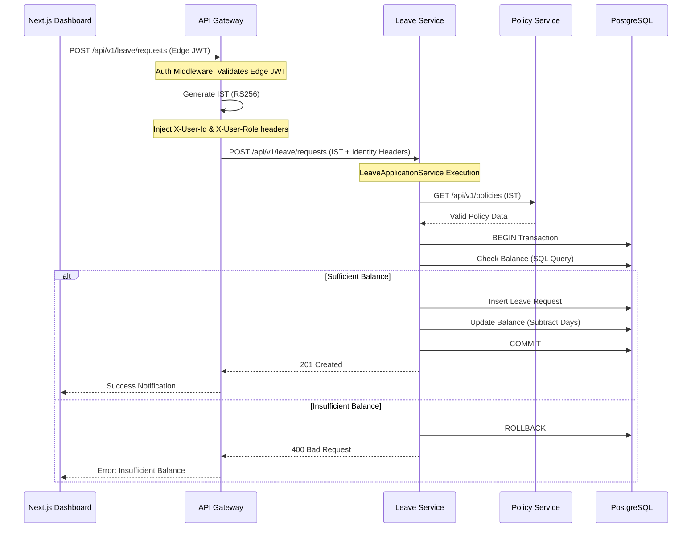

# Technical Design Document

## 🌊 Core Flow: Leave Application
This diagram illustrates the sequence of events when a staff member applies for leave through the dashboard.

## 🏗️ Architecture: Hexagonal Pattern
Each service is partitioned into:
1. **Core Domain:** Business logic (`BigDecimal` calculations, state transitions).
2. **Ports:** Traits defining required behaviors (`LeaveRepository`, `PolicyProvider`).
3. **Adapters:** 
    - **Handler:** Axum HTTP endpoints.
    - **Repository:** SQLx Postgres implementations.
    - **Gateway:** External service clients (reqwest).

## 🔭 Observability Strategy
- **Traces:** Full-stack propagation from Browser -> Gateway -> Services.
- **Context:** Standard OTel `traceparent` headers are used for all inter-service calls.
- **Collector:** OpenTelemetry Collector (v0.31) exports to Jaeger.
- **Identity:** `X-User-Id` is propagated to services to ensure consistent logging of user actions across the trace.
