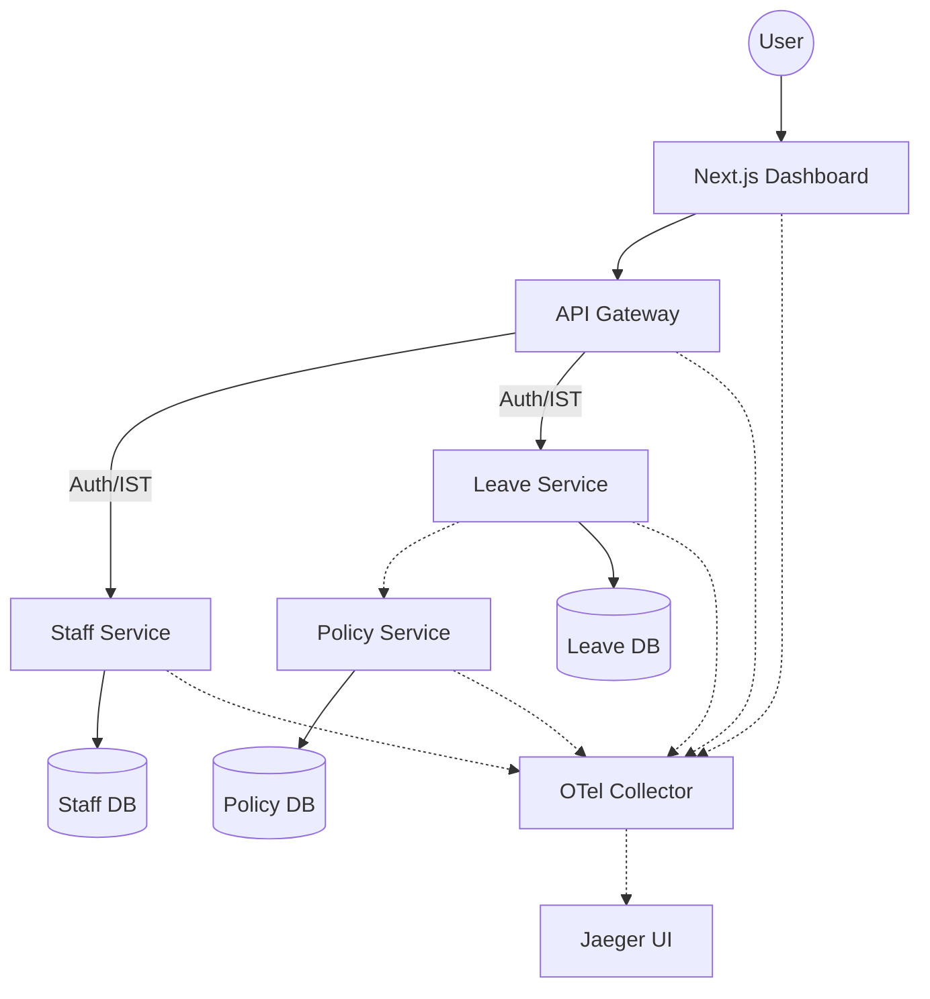

# 🕊️ Leave Management System (LMS) v1.0

A production-grade, microservices-based Leave Management System engineered for **sovereign, high-security environments**. Built with a focus on **Hexagonal Architecture**, **RS256 Trust Chains**, and **Full-Stack Observability**.


---

## 🏗️ Architectural Blueprint

The system is partitioned into autonomous microservices, each strictly adhering to the **Hexagonal Pattern**. Domain logic is isolated from infrastructure, ensuring 100% testability and swap-ability of adapters.



### 🛡️ Security: Internal JWT Trust Chain (ADR-001)
- **Edge Security:** Validates external Edge JWTs at the Gateway.
- **Internal Propagation:** Generates short-lived **RS256 ISTs** (Internal Service Tokens) for downstream calls.
- **Identity Injection:** Automated injection of `X-User-Id` and `X-User-Role` headers for high-performance internal domain lookups.

### 🔭 Observability: Distributed Tracing (ADR-002)
- **Full-Stack Traces:** Browser-side `fetch` calls are automatically linked to backend spans.
- **OTel 0.31 Stack:** High-performance gRPC export to a centralized collector.
- **PII Masking:** Strict domain-level masking ensures sensitive data never enters the telemetry pipeline.

---

## 🛠️ Tech Stack

| Layer | Technologies |
|-------|--------------|
| **Frontend** | Next.js 15, Bun, TanStack Query v5, Lucide Icons, Vanilla CSS (Glassmorphism) |
| **Gateway** | Rust, Axum, Tower-HTTP, Reqwest, Jsonwebtoken |
| **Services** | Rust, SQLx (Postgres), BigDecimal (Atomic Math), Argon2 |
| **DevOps** | Docker, Multi-stage Dockerfiles, OTel Collector, Jaeger |

---

## 🚀 Orchestrated Deployment

The entire ecosystem is containerized and ready for one-command orchestration.

### Prerequisites
- Docker & Docker Compose
- Rust (for local development)
- Bun (for frontend development)

### 1. Launch the Stack
Navigate to the `devops` directory and start the orchestrated services:
```bash
cd devops
docker-compose up --build
```
This command initializes:
- 3x PostgreSQL instances (Staff, Leave, Policy)
- API Gateway (Port 8080)
- Staff, Leave, & Policy Services
- Next.js Web Frontend (Port 3000)
- OTel Collector & Jaeger UI (Port 16686)

### 2. Configuration
Core secrets are managed via environment variables in the `devops/docker-compose.yml`:
- `EDGE_JWT_SECRET`: Used for Edge token validation.
- `IST_PRIVATE_KEY`: RS256 PEM used for internal token signing.

---

## 📊 Monitoring Dashboard
Access the **Jaeger UI** at `http://localhost:16686` to visualize the life of a request across the entire system.

## 📜 Documentation
Comprehensive design records are available in the [Documentation](./Documentation) and [tech](./tech) directories:
- [Technical Design](./Documentation/Technical-Design.md)
- [ADR-001: Authentication](./tech/adr-001-auth.md)
- [ADR-002: Tracing](./tech/adr-002-tracing.md)

---
**License:** Internal Organization Use Only.
**Maintained by:** Antigravity Swarm Agent v1.0
