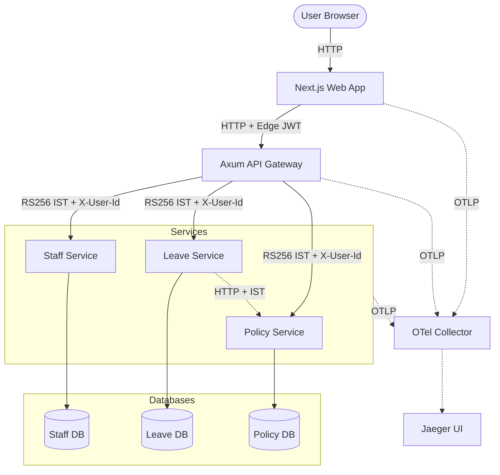

# System Design: Leave Management Microservices

## Component Diagram

## Data Flow: Leave Request Submission
1. **User** submits request via **Web** (Next.js).
2. **Web** propagates its **OTel Trace Context** and calls `/api/v1/leave/requests` on **Gateway**.
3. **Gateway** validates Edge JWT, generates a short-lived **Internal IST** (RS256), and injects `X-User-Id`/`X-User-Role` headers.
4. **Gateway** proxies the request to the **Leave Service**.
5. **Leave Service** consumes the identity headers, validates business rules against the **Policy Service**, and checks staff context via **Staff Service**.
6. **Leave Service** executes a transactional write to the **Leave DB** (using `BigDecimal` for precision).
7. **Gateway** returns the response; the entire lifecycle is captured in a single trace viewable in **Jaeger**.

## Service Responsibilities
- **Staff Service:** Manages employee records, lifecycle, org chart, and **approver delegations**.
- **Leave Service:** Orchestrates leave lifecycle, approvals, and accruals.
- **Policy Service:** Manages leave types, blackout dates, and public holidays.
- **API Gateway:** Handles RBAC enforcement, rate limiting, and edge-to-internal token exchange.

## Networking & Discovery
In the orchestrated environment (Docker Compose):
- **Gateway:** Proxies to `http://staff-service:8081`, `http://leave-service:8082`, etc.
- **Trace Sink:** All components export to `http://otel-collector:4317`.
- **Isolation:** Databases are only accessible within the internal `leave-net` network.
