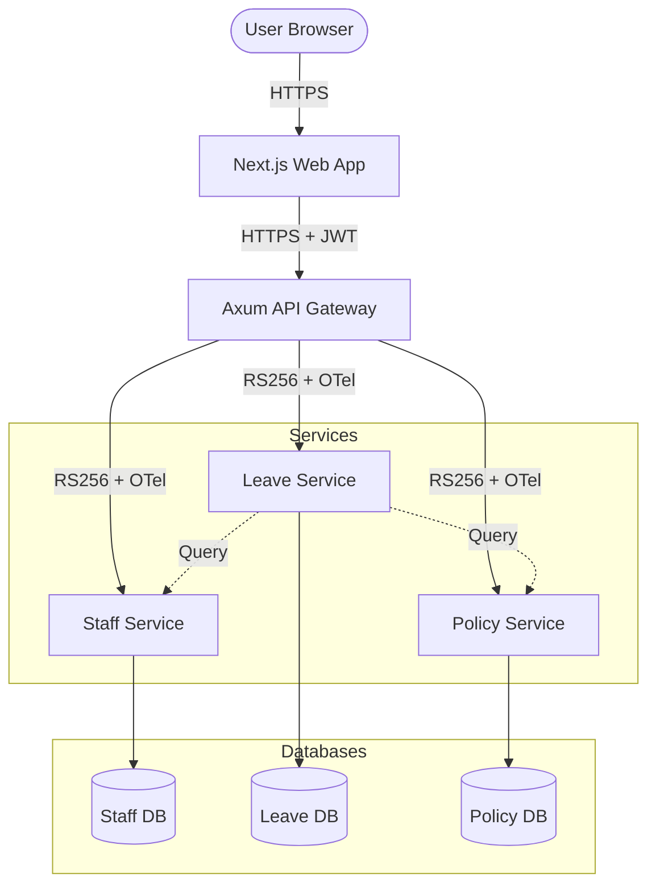

# System Design: Leave Management Microservices

## Component Diagram

## Data Flow: Leave Request Submission
1. **User** submits request via **Web**.
2. **Web** calls `/api/leave` on **Gateway**.
3. **Gateway** validates User JWT, generates **Internal IST**, and starts **OTel Span**.
4. **Gateway** routes to **Leave Service**.
5. **Leave Service** validates IST, checks **Policy Service** for blackout dates, and **Staff Service** for manager info.
6. **Leave Service** writes to **Leave DB** and returns Success.
7. **Gateway** closes span and returns response to **Web**.
